# Cannonball カーソルパッド ビルドガイド
- [キット内容](#キット内容)
- [組み立て方（はんだ付け）](#組み立て方はんだ付け)
- [動作テスト](#動作テスト)
- [組み立て方（後半）](#組み立て方後半)
- [カスタマイズ](#キーマップの確認変更方法)
- [おまけ](#おまけ)

## キット内容
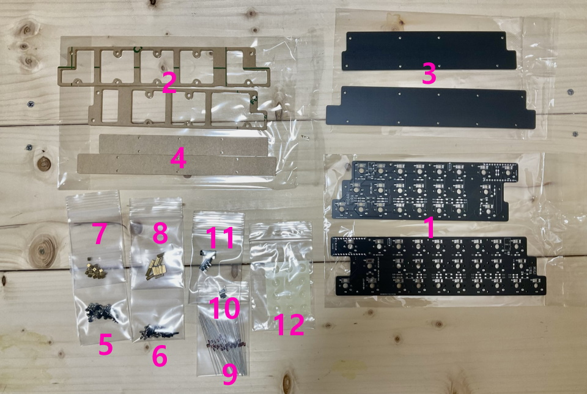  
||部品名|数| |
|-|-|-|-|
|1|メインボード（黒）|1||
|2|ミドルプレート1（透明）|1||
|3|ミドルプレート2（透明）|1||
|4|ボトムプレート（黒）|1||
|5|ネジ（短）|4|3mm|
|6|ネジ（中）|2|4mm|
|7|ネジ（長）|6|6mm|
|7|スペーサー（短）|6|3mm|
|8|スペーサー（中）|2|4mm|
|9|ダイオード|13||
|10|リセットスイッチ|1||
|11|ゴム足|4||

## キット以外に必要なもの
|部品名|数|||
|-|-|-|-|
|Pro Micro コンスルー付き|1||[遊舎工房様販売ページ](https://shop.yushakobo.jp/products/promicro-spring-pinheader)|
|キースイッチ|9|Kailhロープロファイル（V1, V2)||
|キーキャップ|9|対応するもの|1Uが8個、2Uが1個|
|Micro USB ケーブル|1|データ通信対応でUSB2.0 Micro-Bのもの。|
  
## オプション
|部品名|数|||
|-|-|-|-|
|表面実装タイプのダイオード|13||[遊舎工房様販売ページ](https://shop.yushakobo.jp/products/a0800di-02-100)|
|SK6812MINI-E|9|[取り付け方](led.md)|[遊舎工房様販売ページ](https://shop.yushakobo.jp/products/sk6812mini-e-10)|
|WS2812B|3|無くてもバックライトだけ光ります。|[遊舎工房様販売ページ](https://shop.yushakobo.jp/products/a0800ws-01-10)|
 
## 必要な工具
|工具名| |
|-|-|
|はんだごて||
|はんだごて置き場||
|鉛入りはんだ||
|細いドライバー|+の1番ドライバー。|
|ニッパー等ダイオードの足を切れるもの|金属用でない場合刃こぼれします。|
|Microsoft Edge、もしくはGoogle Chrome||

## あると便利な工具
|工具名||
|-|-|
|耐熱シリコンマット||
|斜めに切ったタイプのこて先||
|温度調節可能なはんだごて|300度-350度前後|
|ピンセット|LEDには必須|
|フラックス|LEDには必須|
|テスター||
|フラックスリムーバー||
|マスキングテープ||
|はんだ吸い取り線||
|リードベンダー||

## 組み立て方（はんだ付け）
正しくはんだ付けが終わるとこのようになります。  
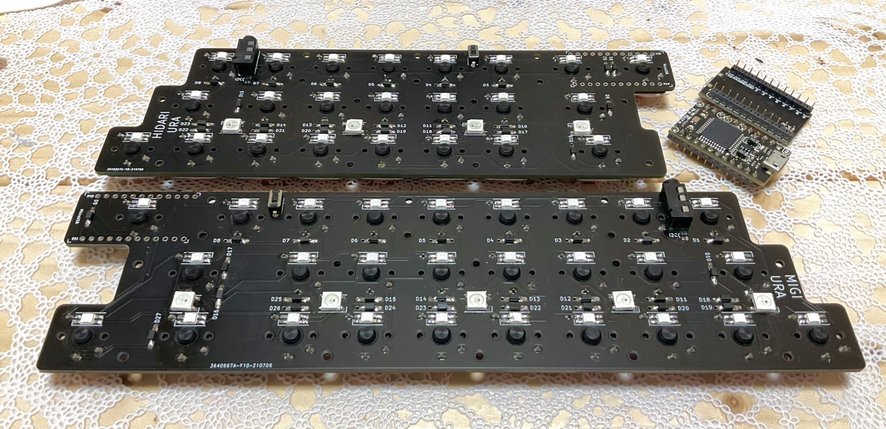 
※作例はダイオードの形状が違い、またLEDとTRRSジャックを取り付けています。

はんだ付けのやり方は動画で見るとわかりやすいです。  
パーツは思ったより壊れないので落ち着いて作業すると失敗しにくいです。  
 - ホームセンターのDCMさんの解説動画(58秒～) https://www.youtube.com/watch?v=JFQg_ObITYE&t=58s
  
それではダイオードをD1からD18まで取り付けます。  
足を曲げて裏から差し込みます。  
ダイオードには向きがあります。三角形の先の棒と黒線を合わせましょう。  
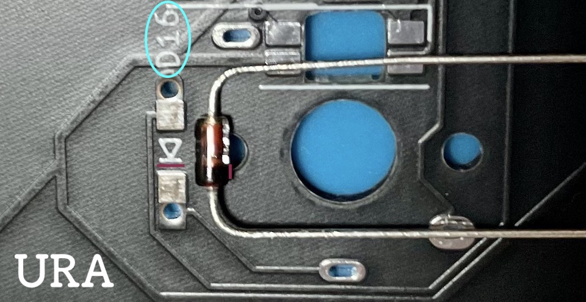  

表で更に足を曲げて抜けないようにします。  
ダイオードと並行に曲げるとあとでキースイッチに干渉しにくいです。
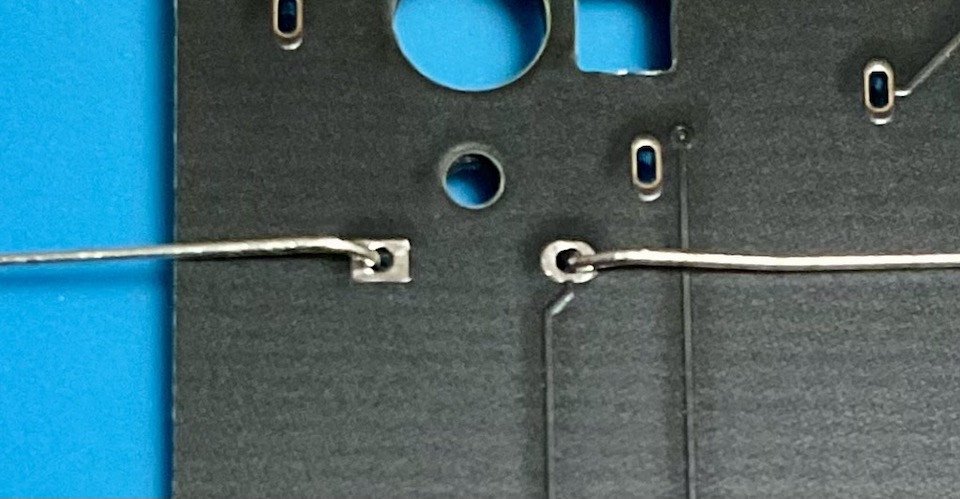  

はんだ付けをして足を切ります。  
マスキングテープでダイオードを固定して足を先に切ると綺麗に仕上がります。  
表面実装型を使うと表からは穴しか見えなくなります。  
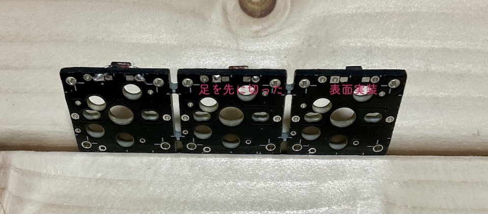  

リセットスイッチを裏から差し込み表ではんだ付けします。  
  

キースイッチを表から差し込み裏ではんだ付けします。  
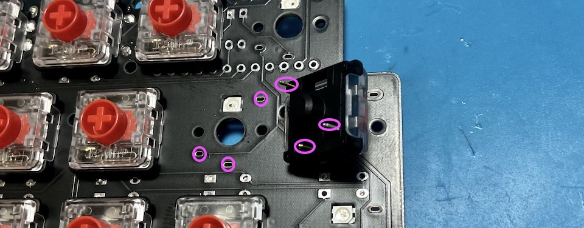  

メインボードの裏にコンスルーを挿します。  
コンスルーの窓が高くて両方とも同じ向きになるように設置します。  
挿すだけではんだ付けはしません。  
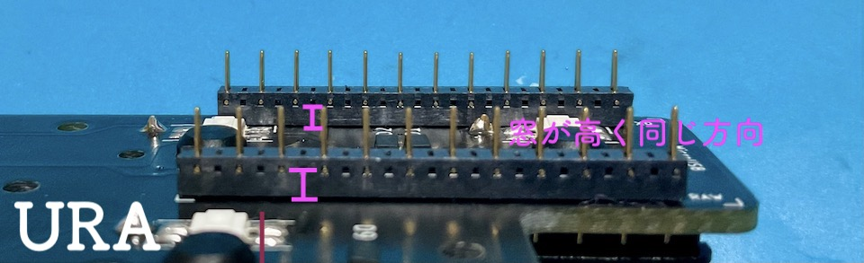   
※画像は違うキットなので場所が違いますが基盤、パーツの裏表は同じです。  

コンスルーにPro Microを挿します。TX0, RAW, USBの位置をシルク印刷と合わせましょう。  
そして、Pro Micro側のコンスルーの足を半田付けします。  
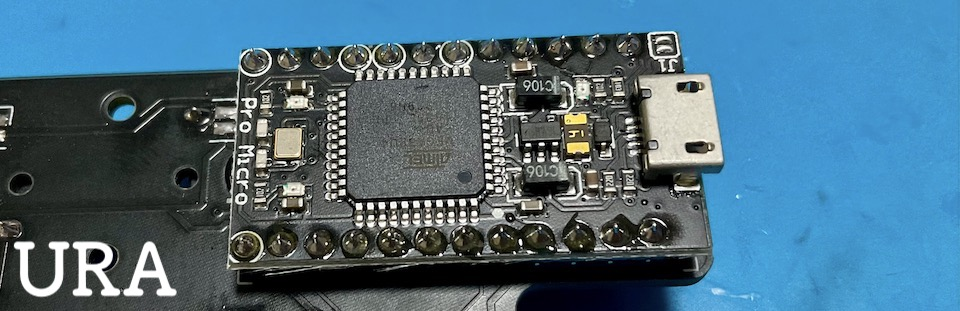   
※画像は違うキットなので場所が違いますが基盤、パーツの裏表は同じです。  

## 動作テスト
Pro Microに動作ソフト（ファームウェア）を書き込んで動作確認をしましょう。  
キットとPCをUSBケーブルでつないでください。   

ファームウェアをダウンロードしてPro Micro Web Updaterにアクセスしてください。
- テスト用ファームウェア [shotgun_test.hex](https://github.com/Taro-Hayashi/Shotgun/releases/download/1.0/shotgun_test.hex)
- Pro Micro Web Updater https://sekigon-gonnoc.github.io/promicro-web-updater/index.html

ファイルの選択ボタンを押してダウンロードしたファームウェアを指定したら、flashボタンを押しましょう。  
  

ブラウザのアドレスバーからメッセージが出てきたら、キットのリセットスイッチを押します。      
すると選択欄にArduino Microが出てきてクリックできるようになります。  
  

選択して接続を押すと書き込みが終わります。  
  
ファームウェアを更新する時もこの手順で行います。  

タイプすると1-18の数字が打てるはずです。  

お疲れ様でした。問題がなければはんだ付けは終了です。

## 組み立て方（後半）
USBケーブルを抜いてプレートを組付けます。  
アクリルからは保護フィルムを剥がしてください。割れやすいので気をつけましょう。  

メインボード裏面の赤丸の箇所にスペーサー（短）をネジ（短）で取り付けてミドルプレート（透明・中）を嵌めます。
  
ボトムプレート（黒・中）をネジ（短）で止めます。  
  
メインボードの残ったネジ穴にスペーサー（長）をネジ（長）で取り付け、ボトムプレート（透明・小）をネジ（長）で止めます。  
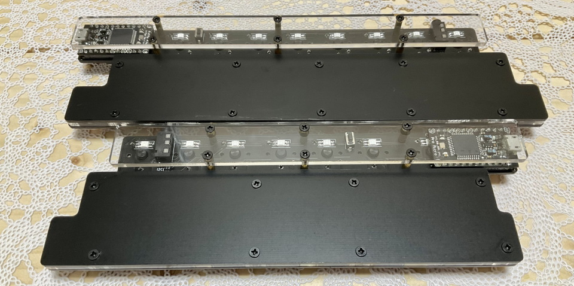   

キーキャップを取り付けたら本番用のファームウェアに更新しましょう。
- [shotgun_via.hex](https://github.com/Taro-Hayashi/Shotgun/releases/download/1.0/shotgun_via.hex)

ゴム足を貼ったら完成です。
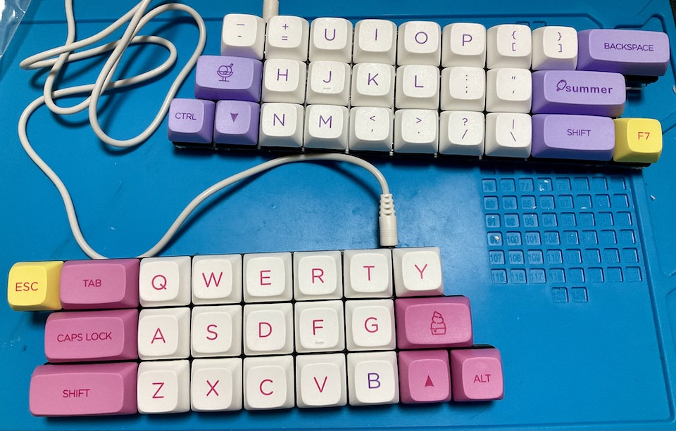  

## キーマップの確認、変更方法
このキットはレイヤー機能を使っています。

[Keyboard Layout Editor で見る](http://www.keyboard-layout-editor.com/##@_backcolor=#ffffff&name=Layout%20-%20Shotgun%20NUMPAD;&@_c=#aaaaaa&a:7&fa@:4;;&=//&_c=#cccccc;&=7&=8&=9&_c=#aaaaaa;&=back%20space&_x:0.5;&=&_c=#8792d6;&=home&=%E2%86%91&=page%20up&_c=#aaaaaa;&=&_x:0.5;&=&_c=#cf7e7e;&=/&&=*&=(&_c=#aaaaaa;&=&_x:0.5&c=#e0cb58;&=%E8%89%B2%E7%9B%B8+&=%E5%BD%A9%E5%BA%A6+&=%E6%98%8E%E5%BA%A6+&_fa@:1;;&=%E3%82%B9%E3%83%94%E3%83%BC%E3%83%89+&_fa@:2;;&=ON//OFF;&@_c=#aaaaaa&fa@:4;;&=*&_c=#cccccc;&=4&=5&=6&_c=#aaaaaa;&=tab&_x:0.5;&=&_c=#8792d6;&=%E2%86%90&_c=#cccccc;&=&_c=#8792d6;&=%E2%86%92&_c=#aaaaaa;&=&_x:0.5;&=&_c=#cf7e7e;&=$&=%25&=%5E&_c=#aaaaaa;&=&_x:0.5&c=#e0cb58&fa@:2;;&=%E5%89%8D%E3%81%AE%E3%83%91%E3%82%BF%E3%83%BC%E3%83%B3&_c=#cccccc;&=&=&=&_c=#e0cb58;&=%E6%AC%A1%E3%81%AE%E3%83%91%E3%82%BF%E3%83%BC%E3%83%B3;&@_c=#aaaaaa&fa@:4;;&=-&_c=#cccccc;&=1&=2&=3&_c=#aaaaaa&t=#000000%0A#c91818&a:5&fa@:4&:1;&h:2;&=%0A%E9%95%B7%E6%8A%BC%E3%81%97UPPER%0A%0A%0A%0A%0Aenter&_x:0.5&t=#000000&a:7;&=&_c=#8792d6;&=end&=%E2%86%93&=page%20down&_t=#dbbc1f&h:2;&=RGB&_x:0.5&c=#aaaaaa&t=#000000;&=&_c=#cf7e7e;&=!&=/@&=#&_c=#e69a9a&h:2;&=&_x:0.5&c=#e0cb58;&=%E8%89%B2%E7%9B%B8-&=%E5%BD%A9%E5%BA%A6-&=%E6%98%8E%E5%BA%A6-&_fa@:1;;&=%E3%82%B9%E3%83%94%E3%83%BC%E3%83%89-&_c=#e0d084&h:2;&=;&@_c=#aaaaaa&t=#000000%0A#152bab&a:5&fa@:1&:1;;&=+%0A%E9%95%B7%E6%8A%BC%E3%81%97LOWER&_c=#cccccc&t=#000000&a:7&fa@:4;&w:2;&=0&=.&_x:1.5&c=#a2abe8;&=&_c=#8792d6&w:2;&=insert&=del&_x:1.5&c=#cf7e7e&t=#dbbc1f;&=RGB&_t=#000000&w:2;&=)&_c=#ccccccc;&=&_x:1.5&c=#dbcb79;&=&_c=#cccccc&w:2;&=&=;&@_x:5.5&t=#152bab&f:3&w:5&h:0.5&d:true;&=LOWER%20LAYER&_x:0.5&t=#c91818&f:3&w:5&h:0.5&d:true;&=UPPER%20LAYER&_x:0.5&t=#a18806&f:3&w:5&h:0.5&d:true;&=RGB%20LAYER)  

使わないキーを削除したり使用頻度の高いキーを押しやすい位置に変更してみましょう。  
  
ChromeかEdgeでRemapにアクセスしてください。  
- Remap https://remap-keys.app/
  
  
左を選んで進んでいくとアドレスバーからメッセージが出てキーボードを選択できます。  
  
変更が終わったら右上のflashボタンを押すと反映されます。  
  
  
上手くいかなくなったときはいったんリセットすると直ることがあります。  
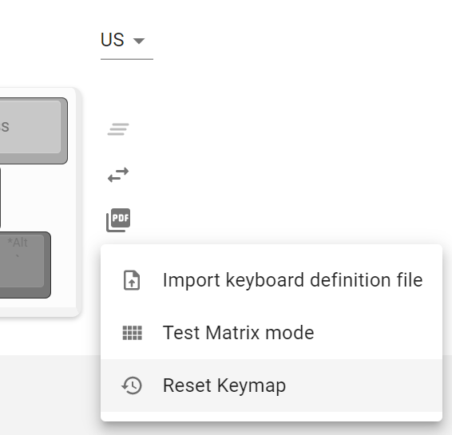  

## その他
ファームウェアのフォルダ  
https://github.com/Taro-Hayashi/qmk_firmware/tree/master/keyboards/shotgun
  
VIA用JSONファイル [shotgun.json](https://github.com/Taro-Hayashi/Shotgun/releases/download/1.0/shotgun.json)  
  
ミドル、ボトムプレートのデザインデータ  
[shotgun_plates.zip](https://github.com/Taro-Hayashi/Shotgun/releases/download/1.0/shotgun.zip)  
発注先のルールに沿ってデータを修正してください。  

ご不明な点があればBOOTHのメッセージかtwitterのリプライでいつでも聞いてください。 
販売ページ: https://tarohayashi.booth.pm/items/3172502
  
foostan様のフットプリントを流用、改変して使わせていただきました。  
https://github.com/foostan/kbd/  
https://github.com/foostan/kbd/blob/master/LICENSE  

 この 作品 は <a rel="license" href="http://creativecommons.org/licenses/by-sa/4.0/">クリエイティブ・コモンズ 表示 - 継承 4.0 国際 ライセンス</a>の下に提供されています。
