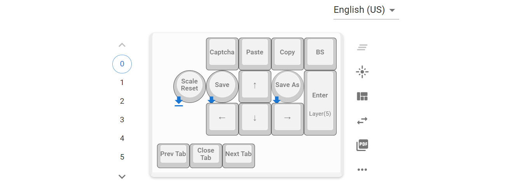

# Cannonball カーソルパッド ビルドガイド
- [キット内容](#キット内容)
- [組み立て方（はんだ付け）](#組み立て方はんだ付け)
- [動作テスト](#動作テスト)
- [組み立て方（後半）](#組み立て方後半)
- [カスタマイズ](#キーマップの確認変更方法)
- [おまけ](#おまけ)

## キット内容
  
||部品名|数| |
|-|-|-|-|
|1|メインボード|1|黒・PCB|
|2|ミドルプレート1|1|透明アクリル・穴の開いている方|
|3|ミドルプレート2|1|透明アクリル|
|4|ボトムプレート|1|黒・PCB|
|5|保護プレート|1|透明アクリル・小さい|
|6|ネジ（短）|4|3mm|
|7|ネジ（中）|2|4mm|
|8|ネジ（長）|6|6mm|
|9|スペーサー（短）|4|3mm|
|10|保護プレート用スペーサー|2x2|3mmと4mm|
|11|ダイオード|13|1N4148|
|12|リセットスイッチ|1||
|13|ロータリーエンコーダ（水平型）|1|EC11互換品|
|14|ノブ|1||
|15|ロータリーエンコーダ（ホイール）|2|EVQWGD001|
|16|レバースイッチ|2|SLLB120300, TMHU28([秋月電子様販売ページ](https://akizukidenshi.com/catalog/g/gP-08072/))|
|17|ゴム足|6||

## キット以外に必要なもの
|部品名|数|||
|-|-|-|-|
|Pro Micro コンスルー付き|1||[遊舎工房様販売ページ](https://shop.yushakobo.jp/products/promicro-spring-pinheader)|
|キースイッチ|9|Kailhロープロファイル（V1, V2)||
|キーキャップ|9|対応するもの|1Uが8個、2Uが1個|
|Micro USB ケーブル|1||
  
## オプション
|部品名|数|||
|-|-|-|-|
|SK6812MINI-E|9|光らせたい場合。[取り付け方](led.md)|[遊舎工房様販売ページ](https://shop.yushakobo.jp/products/sk6812mini-e-10)|
|WS2812B|3|無くてもバックライトだけ光ります。|[遊舎工房様販売ページ](https://shop.yushakobo.jp/products/a0800ws-01-10)|
|1N4148W|13|表面実装タイプのダイオード|[遊舎工房様販売ページ](https://shop.yushakobo.jp/products/a0800di-02-100)|
 
## 必要な工具
|工具名| |
|-|-|
|はんだごて||
|はんだごて置き場||
|鉛入りはんだ||
|フラックス||
|ピンセット||
|細い+ドライバー|1番ドライバー。|
|細い-ドライバー|先端の幅が2mm以下のもの。|
|ニッパー等ダイオードの足を切れるもの|金属用でない場合刃こぼれします。|
|Microsoft Edge、もしくはGoogle Chrome||

## あると便利な工具
|工具名||
|-|-|
|耐熱シリコンマット||
|斜めに切ったタイプのこて先||
|温度調節可能なはんだごて|300度-350度前後|
|テスター||
|フラックスリムーバー||
|マスキングテープ||
|はんだ吸い取り線||
|耐熱絶縁テープ（カプトンテープ）||

## 組み立て方（はんだ付け）
はんだ付けのやり方は動画で見るとわかりやすいです。  
パーツは思ったより壊れないので落ち着いて作業すると失敗しにくいです。  
 - ホームセンターのDCMさんの解説動画(58秒～) https://www.youtube.com/watch?v=JFQg_ObITYE&t=58s
  
それではダイオードをD1からD13まで取り付けます。  
足を曲げて裏から差し込みます。  
ダイオードには向きがあります。三角形の先の棒と黒線を合わせましょう。  
  

表で更に足を曲げて抜けないようにします。  
ダイオードと並行に曲げるとあとでキースイッチに干渉しにくいです。
  

はんだ付けをして足を切ります。  
  
  
レバースイッチを取り付けます。  
  
二か所あるレバースイッチは同じキーが割り当てられます。  
はんだ付け難易度が高いので片方は練習に使って下さい。
  
ランドにフラックスを塗って位置決め用の穴に合わせて乗せます。  
  
  
ピンセットでレバースイッチを押さえながら、はんだごてに乗せたはんだを手前のランドにのせていきます。  
  
  
左右はレバーを押さえながらはんだ付けします。  
  
これら4つは取り付け強度を上げるためのランドで、電気的にはどことも繋がっていません。  
  
  
左右にある二股に分かれている接点ははんだが乗りにくいので無理に接着しなくても大丈夫です。  
  
リセットスイッチを裏から差し込み表ではんだ付けします。  
  
  
フラックスクリーナーを使う人はここで表面を綺麗にしておきましょう。  
  
  
キースイッチを表から差し込み裏ではんだ付けします。  
 
ここの二つのスイッチはPro Microと接触する可能性があるので、足を切ってからはんだ付けします。
  
choc V1スイッチの場合、足が一か所干渉するので短くカットしてください。
  
  
メインボードの裏にコンスルーを挿します。  
   
コンスルーの窓が高くて両方とも同じ向きになるように設置します。  
挿すだけではんだ付けはしません。  
  
コンスルーにPro Microを挿します。TX0, RAW, USBの位置をシルク印刷と合わせましょう。  
カプトンテープをお持ちの方はここでメインボードとPro Microを絶縁しておくと安心です。  
   
  
Pro Micro側のコンスルーの足を半田付けします。  
   
  
表からホイール型のロータリーエンコーダーを取り付けます。  
ピンの位置を確認してツメを穴に差し込みます。  
  
  
ツメを穴に引っかけてからピンを穴に差し込みます。
ピンを曲げてしまわないように注意してください。
  
  
差し込めたらはんだ付けします。
  
  
表から水平型のロータリーエンコーダーを取り付けて裏からはんだ付けします。
 
ピンが曲がらないように気を付けましょう。  
  
クリップの部分ははんだ付けしなくても構いません。  
  
  

## 動作テスト
Pro Microに動作ソフト（ファームウェア）を書き込んで動作確認をしましょう。  
キットとPCをUSBケーブルでつないでください。   

ファームウェアをダウンロードしてPro Micro Web Updaterにアクセスしてください。
- テスト用ファームウェア [shotgun_test.hex](https://github.com/Taro-Hayashi/Shotgun/releases/download/1.0/shotgun_test.hex)
- Pro Micro Web Updater https://sekigon-gonnoc.github.io/promicro-web-updater/index.html

ファイルの選択ボタンを押してダウンロードしたファームウェアを指定したら、flashボタンを押しましょう。  
  

ブラウザのアドレスバーからメッセージが出てきたら、キットのリセットスイッチを押します。      
すると選択欄にArduino Microが出てきてクリックできるようになります。  
  

選択して接続を押すと書き込みが終わります。  
  
ファームウェアを更新する時もこの手順で行います。  

すべてのスイッチで何らかの数字が打てるはずです（1-21)。  

お疲れ様でした。問題がなければはんだ付けは終了です。

## 組み立て方（後半）
USBケーブルを抜いてプレートを組付けます。  
アクリルからは保護フィルムを剥がしてください。割れやすいので気をつけましょう。  
  

メインボードの赤丸のネジ穴に保護プレート用スペーサーを付けます。  
  
図のようにキースイッチがついてる側に少し長い方のスペーサーがあるようにしてください。  
  
  
メインボード裏面のネジ穴にスペーサー（短）をネジ（短）で取り付けてミドルプレート1（透明）を嵌めます。
  

ミドルプレート2とバックプレートをネジ（長）で止めます。
  
  

表に保護プレートをネジ（中）で取り付けましょう。
  

キーキャップを取り付けたら本番用のファームウェアに更新しましょう。
- [cannonball_via.hex](https://github.com/Taro-Hayashi/Shotgun/releases/download/1.0/shotgun_via.hex)

マイナスドライバーでノブを取りつけ、ゴム足を貼ったら完成です。
  
  

## キーマップの確認、変更方法
このキットはレイヤー機能を使っています。  
  
[Keyboard Layout Editor で見る](http://www.keyboard-layout-editor.com/##@_backcolor=%23ffffff&name=Layout%20-%20Cannonball%20CURSORPAD&author=T.Hayashi&notes=https%2F:%2F%2F%2F%2Ftarohayashi.booth.pm%2F%2Fitems%2F%2F3172502%3B&@_x:1&a:7%3B&=Print%20Screen&=home&=end&=back%20space&_x:0.75&t=%23a18806&d:true%3B&=RGB&_c=%23e0cb58&t=%23000000%3B&=%E8%89%B2%E7%9B%B8+&=%E5%BD%A9%E5%BA%A6+&=%E6%98%8E%E5%BA%A6+&_fa@:1%3B%3B&=%E5%89%8D%E3%81%AE%E3%83%91%E3%82%BF%E3%83%BC%E3%83%B3%3B&@_c=%23777777&a:5&fa@:1&:1%3B%3B&=%E7%B8%AE%E5%B0%8F%0A%E6%8B%A1%E5%A4%A7&_fa@:0&:0&:0&:0&:0&:0&:1%3B%3B&=%E2%86%91%0A%E2%86%93%0A%0A%0A%0A%0A%E3%83%9B%E3%82%A4%E3%83%BC%E3%83%AB&_c=%23cccccc&a:7%3B&=%E2%86%91&_c=%23777777&a:4&fa@:0&:0&:0&:0&:0&:0&:1&:0&:0&:1%3B%3B&=%0A%E2%86%90%0A%0A%E2%86%92%0A%0A%0A%0A%0A%0A%E3%83%9B%E3%82%A4%E3%83%BC%E3%83%AB&_c=%23aaaaaa&t=%23000000%0A%23ffdc36&a:5&f:3&h:2%3B&=%0A%E9%95%B7%E6%8A%BC%E3%81%97LED%0A%0A%0A%0A%0Aenter&_x:0.75&c=%23e0cb58&t=%23000000&a:7&fa@:1%3B%3B&=ON%2F%2FOFF&_c=%23cccccc%3B&=&_c=%23e0cb58%3B&=%E6%AC%A1%E3%81%AE%E3%83%91%E3%82%BF%E3%83%BC%E3%83%B3&_c=%23cccccc%3B&=&_c=%23e0cb58&h:2%3B&=%3B&@_x:1&c=%23cccccc&f:3%3B&=%E2%86%90&_f:3%3B&=%E2%86%93&_f:3%3B&=%E2%86%92&_x:2.75&c=%23e0cb58&f:3%3B&=%E8%89%B2%E7%9B%B8-&_f:3%3B&=%E5%BD%A9%E5%BA%A6-&_f:3%3B&=%E6%98%8E%E5%BA%A6-%3B&@_r:-45&ry:3.5&y:-0.5&c=%23777777&a:5&f:3%3B&=%E5%89%8D%E3%82%BF%E3%83%96%0A%E6%AC%A1%E3%82%BF%E3%83%96%3B&@_ry:5.25&y:2.25&x:5.25&c=%23e0cb58&fa@:1&:1%3B%3B&=%E3%82%B9%E3%83%94%E3%83%BC%E3%83%89+%0A%E3%82%B9%E3%83%94%E3%83%BC%E3%83%89-)  
  
使わないキーを削除したり使用頻度の高いキーを押しやすい位置に変更してみましょう。  
  
ChromeかEdgeでRemapにアクセスしてください。  
- Remap https://remap-keys.app/
  
  
左を選んで進んでいくとアドレスバーからメッセージが出てキーボードを選択できます。  
  
ドラッグアンドドロップでキーマップの変更が終わったら右上のflashボタンを押すと反映されます。  
  
  
## 左手で使う場合
左手レイアウト用のJSONファイルをダウンロードして、Remapに読み込ませてください。
- [cannonball_left.json](https://github.com/Taro-Hayashi/Shotgun/releases/download/1.0/shotgun.json)  
  
  
  
## その他
ファームウェアのフォルダ  
https://github.com/Taro-Hayashi/qmk_firmware/tree/master/keyboards/cannonball
  
VIA用JSONファイル
- 右手用 [cannonball.json](https://github.com/Taro-Hayashi/Shotgun/releases/download/1.0/shotgun.json)  
- 左手用 [cannonball_left.json](https://github.com/Taro-Hayashi/Shotgun/releases/download/1.0/shotgun.json)  
  
ミドル、ボトムプレートのデザインデータ  
[shotgun_plates.zip](https://github.com/Taro-Hayashi/Shotgun/releases/download/1.0/shotgun.zip)  
発注先のルールに沿ってデータを修正してください。  

ご不明な点があればBOOTHのメッセージやtwitterでいつでも聞いてください。  
販売ページ: https://tarohayashi.booth.pm/items/3172502
  
foostan様のフットプリントを流用、改変して使わせていただきました。  
https://github.com/foostan/kbd/  
https://github.com/foostan/kbd/blob/master/LICENSE  
  
plut0nium様のフットプリントを流用、改変して使わせていただきました。 
https://github.com/plut0nium/0xLib  
https://github.com/plut0nium/0xLib/blob/master/LICENSE.txt  
  
 この キット は <a rel="license" href="http://creativecommons.org/licenses/by-sa/4.0/">クリエイティブ・コモンズ 表示 - 継承 4.0 国際 ライセンス</a>の下に提供されています。
