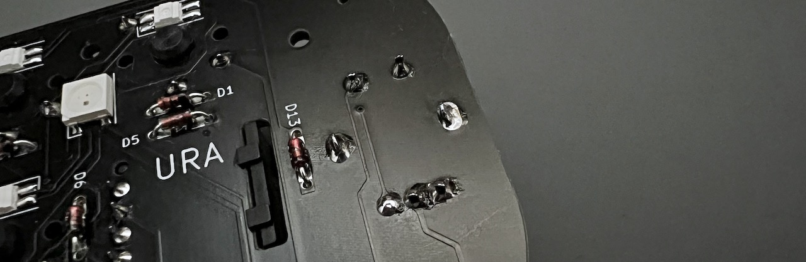

# Cannonball カーソルパッド ビルドガイド（[English](https://github.com/Taro-Hayashi/Cannonball/blob/main/README_EN.md)）
- [キット内容](#キット内容)
- [準備](#準備)
- [はんだ付け](#はんだ付け)
- [組み立て](#組み立て)
- [キーのカスタマイズ](#キーのカスタマイズ)
- [その他](#その他)

## キット内容
 
||部品名|数| |
|-|-|-|-|
|1|メインボード|1||
|2|ボトムプレート|1||
|3|ミドルプレート1|1||
|4|ミドルプレート2|1||
|5|保護プレート|1||
|6|ネジ（短）|4|3mm|
|7|ネジ（中）|2|5mm|
|8|ネジ（長）|6|6mm|
|9|スペーサー（短）|6|3mm|
|10|スペーサー（中）|2|4mm|
|11|ダイオード|13|1N4148|
|12|リセットスイッチ|1||
|13|ロータリーエンコーダ（ダイヤル）|1|EC11互換品|
|14|ノブ|1||
|15|ロータリーエンコーダ（ホイール）|2|EVQWGD001|
|16|ゴム足|6||
|17|Pro Micro|1||

### キット以外に必要なもの
|部品名|数||
|-|-|-|
|キースイッチ|9|[Kailh choc V1](https://shop.yushakobo.jp/collections/all-switches/products/pg1350)、もしくは[Kailh Choc V2](https://shop.yushakobo.jp/collections/all-switches/products/kailh-choc-v2)|
|キーキャップ|9|V1は[専用キーキャップ](https://shop.yushakobo.jp/collections/keycaps/For-Choc-v1)、V2は[CherryMX互換](https://shop.yushakobo.jp/collections/keycaps/cherry-mx-%E4%BA%92%E6%8F%9B-%E3%82%AD%E3%83%BC%E3%82%AD%E3%83%A3%E3%83%83%E3%83%97)です。|
|Micro USB ケーブル|1||

### 必要な工具
|工具名|
|-|
|はんだごて|
|はんだ|
|精密ドライバー|
|ニッパー等ダイオードの足を切れるもの|
|エポシキ接着剤|

### オプション

LEDを光らせる場合
|部品名|数||
|-|-|-|
|[SK6812MINI-E](https://shop.yushakobo.jp/products/sk6812mini-e-10)|9|バックライト|
|[WS2812B](https://shop.yushakobo.jp/products/a0800ws-01-10)|3|アンダーグロー|

USB Type-Cに変更する場合
|部品名|数||
|-|-|-|
|Type-C版Pro Micro|1|[DailyCraftKeyboard](https://shop.dailycraft.jp/products/promicro_typec)、[Talpkeyboard](https://talpkeyboard.net/items/62e24e6f8a0bd07fe2d38137)、[遊舎工房](https://shop.yushakobo.jp/products/sk6812mini-e-10)|
|3.5mmコンスルー|2|[DailyCraftKeyboard](https://shop.dailycraft.jp/products/conthrough_12_35)、[Talpkeyboard](https://talpkeyboard.net/items/6229e8c130344b271f290c3c)、[マルツ電子](https://www.marutsu.co.jp/pc/i/2349912/)|
- [コンスルーの使用方法とPro Micro互換品の対応表](promicro.md)  

色違いのアクリルプレート
- [キーボードアクリルプレート（遊舎工房）](https://shop.yushakobo.jp/collections/services/products/keyboard_acrylic_plate?variant=43890230296807)

## 準備
Pro MicroはMicro-USB端子をエポシキ接着剤で補強します。  
  
両サイドと手前側のはんだ付けされてるところに少し厚めに塗ります。端子の中に入り込まないように気を付けます。
  
乾燥させている間にはんだ付けを進めましょう。  

  
## はんだ付け
はんだ付けのやり方は動画で見るとわかりやすいです。  
パーツは思ったより壊れないので落ち着いて作業すると失敗しにくいです。  
 - ホームセンターのDCMさんの解説動画(58秒～)  
  

### LEDのはんだ付け（オプション）

LEDを取り付ける場合はメインボードに最初にはんだ付けします。
 - [LEDの取り付け方](led.md)  

### ダイオード、リセットスイッチのはんだ付け

D1からD13までダイオードを取り付けます。  
足を曲げて裏から差し込みます。  

  
ダイオードには向きがあります。三角形の先の棒と黒線を合わせましょう。  

表で更に足を曲げて抜けないようにします。  
 
ダイオードと並行に曲げるとあとでキースイッチに干渉しにくいです。  

はんだ付けをして足を切ります。  
  

リセットスイッチを裏から差し込み表ではんだ付けします。  
 

フラックスクリーナーを使う人はここで表面を綺麗にしておきましょう。  
 

### ピンヘッダーのはんだ付け（Pro Microはまだはんだ付けしません）
Pro Microの取り付け場所にピンヘッダーの短い側を差し込みます。
  
位置決めのためにPro Mioroを乗せますが、はんだ付けはせず表にします。
 
  
メインボードにピンヘッダーをはんだ付けします。
  
Pro Microをいったん外します。

### キースイッチのはんだ付け

ここの二つのキースイッチは足がPro Microと干渉するので短く切ります。
  
差し込んだ状態で短く切りましょう。
  
Choc V2の場合は3本の足を、Choc V1では2本の足と固定用ピンの一つを短くします。
  
  
全てのスイッチをはんだ付けします。　　
  

### Pro Microのはんだ付け
隠れてしまうダイオードD3,D4の方向が合っているか、キースイッチの足がはんだ付けされているかを再度確認してください。  
足をニッパーで切ったらはんだ付けします。
  
  

### 動作テスト
ロータリーエンコーダーを取り付ける前にPro Microに動作ソフト（ファームウェア）を書き込んで動作確認をしましょう。  
キットとPCをUSBケーブルでつなぎ、こちらのファイルをダウンロードしてください。

- [tarohayashi_cannonball_test.hex](https://github.com/Taro-Hayashi/Cannonball/releases/download/0.21.4/tarohayashi_cannonball_test.hex)

こちらのwebサイトにGoogle ChromeかMicrosoft Edgeでアクセスしてください。

- [Pro Micro Web Updater](https://sekigon-gonnoc.github.io/promicro-web-updater/index.html)

先ほどダウンロードしたファイルを選択しflashを押すとダイアログが出てきます。
  

リセットボタンを押すとダイアログにPro Microが出てくるのせ選択して接続します。
※リセットボタンを2連打する必要がある場合があります。
  

自動的にファームウェアが書き込まれ、"Verify OK"が出れば書き込み完了です。
  

Pro Micro Web Updaterを使ってファームウェアの更新ができない場合は、QMK Toolboxをお試しください。  
- [QMK Toolboxを使ったファームウェア更新方法](firmware.md)

キー反応することを確認したらロータリーエンコーダーをはんだ付けします。

### ロータリーエンコーダーのはんだ付け
表からホイール型のロータリーエンコーダーを取り付けます。  
ピンの位置を確認してツメを穴に差し込みます。  
  

ツメを穴に引っかけてからピンを穴に差し込みます。
ピンを曲げてしまわないように注意してください。
   

差し込めたらはんだ付けします。
   

表からダイヤル型のロータリーエンコーダーを取り付けて裏からはんだ付けします。
  
クリップの部分ははんだ付けしなくても構いません。  
  

お疲れ様でした。再び動作を確認して問題がなければはんだ付けは終了です。

## 組み立て
USBケーブルを抜いてプレートを組付けます。  
アクリルからは保護フィルムを剥がしてください。  

メインボードのネジ穴にスペーサー（短）をネジ（短）で取り付けてミドルプレート1（透明）を嵌めます。
   
ここの2箇所は表側はネジではなくスペーサー（中）で止めます。
  

ミドルプレート2とバックプレートをネジ（長）で止めます。
  
ゴム足も取り付けました。
  

表に保護プレートをネジ（中）で取り付けましょう。
  

キーキャップとノブをつけて完成です。  
  

先ほどと同様の手順で本番用のファームウェアに更新しましょう。  
こちらのファームウェアをダウンロードして書き換えてしてください。
- [tarohayashi_cannonball_via.hex](https://github.com/Taro-Hayashi/Cannonball/releases/download/0.21.4/tarohayashi_cannonball_via.hex)

※リセットボタンを押す代わりにUSBに一番近いキーを押しながらケーブルを接続し、少し待って離すことでも書き換え可能です。
## キーのカスタマイズ
標準では次のようなキー設定になっています。  
  

使わないキーを削除したり使用頻度の高いキーを押しやすい位置に変更してみましょう。  

こちらのJSONファイルをダウンロードしてください。
- [cannonball.json](https://github.com/Taro-Hayashi/Cannonball/releases/download/0.21.4/cannonball.json)

こちらのwebサイトにGoogle ChromeかMicrosoft Edgeでアクセスするか、VIAのアプリケーションをダウンロードして起動してください。  
- [Web版VIA](https://usevia.app/#/design)
- [アプリ版VIA](https://github.com/the-via/releases/releases)

DESIGNタブのLoadでダウンロードしたJSONファイルを読み込ませるとキーの変更が出来るようになります（アプリ版ではまずShow Design tabをオンにしてください）。
  

CONFIGUREタブのAuthorize device+からCannonballを追加してください。
JSONファイルは一度読み込むとブラウザに保存されるので次からは接続するだけで使うことができます。

### 保存と復元
VIAで設定したキーマップは保存、復元することができます。ファームウェアを入れ替えると初期化されるので保存しておくと便利です。
  
### 置く向きに合わせる
LAYOUTSから見た目の左右を変更することができます。
  

### 通常のキーの割り当て
入れ替えたいキーを上から選んで、下のキーコード一覧をクリックすると設定できます。
  

### ホイールのキーの割り当て
丸いキーを選ぶとホイールに割り当てるキーを設定できます。
  

### 特殊なキーの割り当て
SPECIALタブのANYキーに直接入力することでいろいろな機能を設定することができます。
  
ここで紹介しているのはほんの一部です。
#### 修飾キーの同時押し
修飾キー（Shift、Ctrlなど）と通常のキーの組み合わせを1キーに割り当てることができます。
|機能|キーコード|
|-|-|
|Ctrl|C(キーコード)|
|Shift|S(キーコード)|
|Win、Cmd|G(キーコード)|
|Alt、Opt|A(キーコード)|
|Ctrl+Shift|RCS(キーコード)|
|Win、Cmd+Shift|LSG(キーコード)|

例えばCtrl+Sのキーは
~~~
C(KC_S)
~~~
となります。

詳しくはこちらをご覧ください。
- https://github.com/qmk/qmk_firmware/blob/master/docs/mod_tap.md

#### Mod-Tap
長押しで修飾キー、短押しで通常のキーが打てるようなキーを設定できます。

|機能|キーコード|
|-|-|
|Ctrl|LCTL_T(キーコード)|
|Shift|LSFT_T(キーコード)|
|Win、Cmd|LGUI_T(キーコード)|
|Alt、Opt|LALT_T(キーコード)|
|Ctrl+Shift|RCS_T(キーコード)|
|Win、Cmd+Shift|LSG_T(キーコード)|

長押しでShift、短押しでZの場合は
~~~
LSFT_T(KC_Z)
~~~
です。

詳しくはこちらをご覧ください。
- https://github.com/qmk/qmk_firmware/blob/master/docs/mod_tap.md

#### レイヤーキー
レイヤーの切り替え方法は複数あります。
|機能|キーコード|
|-|-|
|押している間だけ切り替え|MO(レイヤー番号)|
|押すと切り替え、もう一度押すと戻る|TG(レイヤー番号)|
|長押しでレイヤー切り替え、短押しは通常キー|LT(レイヤー番号、キーコード)|

詳しくはこちらをご覧ください。
- https://github.com/qmk/qmk_firmware/blob/master/docs/feature_layers.md
## その他
### Bluetooth接続
- [BLE Micro Pro使用例](ble.md)

### ぱいとん様のゆっくり実況動画  
ユーザーの方が組み立ての手順をとてもわかりやすく動画にしてくださいました。   
ご購入の前に雰囲気を掴んだり、ビルドガイドと一緒に見ながら作業するとわかりやすいと思いますのでぜひご覧ください。  
  

### ファームウェアまとめ
- テスト用 [tarohayashi_cannonball_test.hex](https://github.com/Taro-Hayashi/Cannonball/releases/download/0.21.4/tarohayashi_cannonball_test.hex)
- 本番用 [tarohayashi_cannonball_via.hex](https://github.com/Taro-Hayashi/Cannonball/releases/download/0.21.4/tarohayashi_cannonball_via.hex)

### VIA用JSON
- [cannonball.json](https://github.com/Taro-Hayashi/Cannonball/releases/download/0.21.4/cannonball.json)
  
### ファームウェアのフォルダ  
https://github.com/Taro-Hayashi/qmk_firmware/tree/tarohayashi/keyboards/tarohayashi/cannonball

### プレートのデザインデータ  
[cannonball_plates.zip](https://github.com/Taro-Hayashi/Cannonball/releases/download/14.31/cannonball_plates.zip)  
発注先のルールに沿ってデータを修正してください。  

### 謝辞
foostan様のフットプリントを流用、改変して使わせていただきました。  
https://github.com/foostan/kbd/  
https://github.com/foostan/kbd/blob/master/LICENSE  

plut0nium様のフットプリントを流用、改変して使わせていただきました。  
https://github.com/plut0nium/0xLib  
https://github.com/plut0nium/0xLib/blob/master/LICENSE.txt  

 この キット は <a rel="license" href="http://creativecommons.org/licenses/by-sa/4.0/">クリエイティブ・コモンズ 表示 - 継承 4.0 国際 ライセンス</a>の下に提供されています。

### 販売サイト
- 遊舎工房: https://shop.yushakobo.jp/collections/keyboard/products/2797   
- BOOTH: https://tarohayashi.booth.pm/items/3172502

