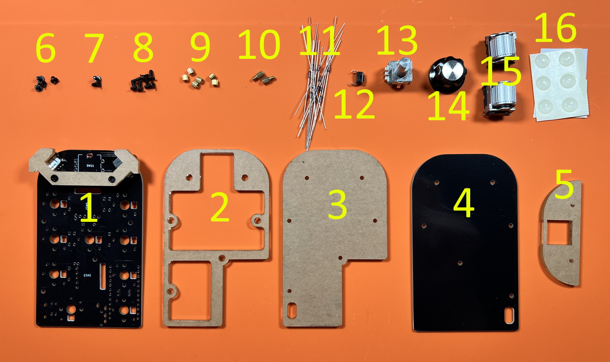
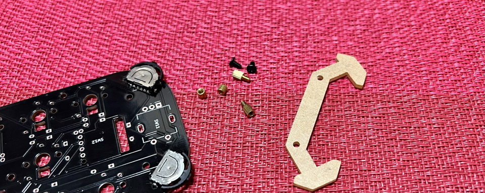

# Cannonball カーソルパッド Build Manual ([日本語](https://github.com/Taro-Hayashi/Cannonball/blob/main/README.md))
- [Contents](#Contents)
- [Soldering](#Soldering)
- [Testing](#Testing)
- [Assembling](#Assembling)
- [Customize](#Customize)

## Contents

||Name|Quantities| |
|-|-|-|-|
|1|Main Board|1||
|2|Middle plate #1|1||
|3|Middle plate #2|1||
|4|Bottom plate|1||
|5|Cover plate|1||
|6|Short screws|4|3mm|
|7|Middle screws|2|4mm|
|8|Long screws|6|6mm|
|9|Short spacers|6|3mm|
|10|Middle spacers|2|4mm|
|11|Diodes|13|1N4148|
|12|Tactile Switches|1||
|13|Dial Rotary Encoder|1|EC11|
|14|Knob|1||
|15|Wheel Rotary Encoders|2|EVQWGD001|
|16|Lever Switches|2|Assembled|
|17|Rubber feet|6||

## Additional required
|Name|Quantities|||
|-|-|-|-|
|Pro Micro コンスルー付き|1||[遊舎工房様販売ページ](https://shop.yushakobo.jp/products/promicro-spring-pinheader)|
|キースイッチ|9|Kailhロープロファイル（V1, V2)||
|キーキャップ|9|対応するもの|1Uが8個、2Uが1個|
|Micro USB ケーブル|1||

## Optional
|Name|Quantities||
|-|-|-|
|SK6812MINI-E|9|[Yushakobo](https://shop.yushakobo.jp/products/sk6812mini-e-10)|
|WS2812B|3|[Yushakobo](https://shop.yushakobo.jp/products/a0800ws-01-10)|

## 必要な工具
|工具名| |
|-|-|
|はんだごて||
|はんだごて置き場||
|鉛入りはんだ||
|細い+ドライバー|1番ドライバー。|
|細い-ドライバー|先端の幅が2mm以下のもの。|
|ニッパー等ダイオードの足を切れるもの|金属用でない場合刃こぼれします。|
|Microsoft Edge、もしくはGoogle Chrome||

## あると便利な工具
|工具名||
|-|-|
|耐熱シリコンマット||
|斜めに切ったタイプのこて先||
|温度調節可能なはんだごて|300度-350度前後|
|フラックス||
|ピンセット||
|テスター||
|フラックスリムーバー||
|マスキングテープ||
|はんだ吸い取り線||
|耐熱絶縁テープ（カプトンテープ）||

## 組み立て方（はんだ付け）
発送での事故防止のためのプレートとネジ、スペーサーを取り外します。  
  
ネジ、スペーサーは予備としてお使いください。

はんだ付けのやり方は動画で見るとわかりやすいです。  
パーツは思ったより壊れないので落ち着いて作業すると失敗しにくいです。  
 - ホームセンターのDCMさんの解説動画(58秒～) https://www.youtube.com/watch?v=JFQg_ObITYE&t=58s

それではダイオードをD1からD13まで取り付けます。  
足を曲げて裏から差し込みます。  
ダイオードには向きがあります。三角形の先の棒と黒線を合わせましょう。  
  

表で更に足を曲げて抜けないようにします。  
ダイオードと並行に曲げるとあとでキースイッチに干渉しにくいです。
  

はんだ付けをして足を切ります。  
  

リセットスイッチを裏から差し込み表ではんだ付けします。  
  

フラックスクリーナーを使う人はここで表面を綺麗にしておきましょう。  
  

キースイッチを表から差し込み裏ではんだ付けします。  
  
ここの二つのスイッチはPro Microと接触する可能性があるので、足を切ってからはんだ付けします。
  
choc V1スイッチの場合、足が一か所干渉するので短くカットしてください。
  

メインボードの裏にコンスルーを挿します。  
   
コンスルーの窓が高くて両方とも同じ向きになるように設置します。  
挿すだけではんだ付けはしません。  

コンスルーにPro Microを挿します。TX0, RAW, USBの位置をシルク印刷と合わせましょう。  
カプトンテープをお持ちの方はここでメインボードとPro Microを絶縁しておくと安心です。  
   

Pro Micro側のコンスルーの足を半田付けします。  
   

表からホイール型のロータリーエンコーダーを取り付けます。  
ピンの位置を確認してツメを穴に差し込みます。  
  

ツメを穴に引っかけてからピンを穴に差し込みます。
ピンを曲げてしまわないように注意してください。
  

差し込めたらはんだ付けします。
  

表から水平型のロータリーエンコーダーを取り付けて裏からはんだ付けします。

ピンが曲がらないように気を付けましょう。  
  
クリップの部分ははんだ付けしなくても構いません。  
  

## 動作テスト
Pro Microに動作ソフト（ファームウェア）を書き込んで動作確認をしましょう。  
キットとPCをUSBケーブルでつないでください。   

下のwebサイトにアクセスしてください。
- https://remap-keys.app/catalog/dTmFWd6gilf5ziDWE1TR/firmware

テストファームウェアを選んでFLASHします。
  
  

キットのリセットスイッチを押すとArduino Microが現れるので、クリックして接続します。
 

書き込みが完了したらウィンドウを閉じて大丈夫です。
 

アドレスバーやテキストエディタを使ってすべてのスイッチが反応することを確かめてください。  
お疲れ様でした。問題がなければはんだ付けは終了です。

## 組み立て方（後半）
USBケーブルを抜いてプレートを組付けます。  
アクリルからは保護フィルムを剥がしてください。割れやすいので気をつけましょう。  

メインボードの赤丸のネジ穴を通してスペーサー（短）とスペーサー（中）を繋ぎます。  
  
図のようにキースイッチがついてる側に少し長い方のスペーサーがあるようにしてください。  
  

メインボード裏面のネジ穴にスペーサー（短）をネジ（短）で取り付けてミドルプレート1（透明）を嵌めます。
  

ミドルプレート2とバックプレートをネジ（長）で止めます。
  
  

表に保護プレートをネジ（中）で取り付けましょう。
  

キーキャップを取り付けたら先ほどと同様の手順で本番用のファームウェアに更新しましょう。
- https://remap-keys.app/catalog/dTmFWd6gilf5ziDWE1TR/firmware
  

マイナスドライバーでノブを取りつけ、ゴム足を貼ったら完成です。
  
  

## キーマップの確認、変更方法
このキットはレイヤー機能を使っています。  
  
[Keyboard Layout Editor で見る](http://www.keyboard-layout-editor.com/#/gists/2fe2023fd6a9318985b9c40c264c6cef)  

使わないキーを削除したり使用頻度の高いキーを押しやすい位置に変更してみましょう。  

ChromeかEdgeでRemapにアクセスしてください。  
- Remap https://remap-keys.app/

  
左を選んで進んでいくとアドレスバーからメッセージが出てキーボードを選択できます。  

ドラッグアンドドロップでキーマップの変更が終わったら右上のflashボタンを押すと反映されます。  
  

## 左手で使う場合
左手レイアウト用のJSONファイルをダウンロードして、Remapに読み込ませてください。
- [cannonball_left.json](https://github.com/Taro-Hayashi/Cannonball/releases/download/14.15/cannonball_left.json)  
  

## 9月10日にご購入されたお客さまへ
機能の一部に不具合がございます。  
修正した基板の発送をご案内していますのでご覧ください。  
https://twitter.com/w_vwbw/status/1440305043870154764

## その他
ファームウェアのフォルダ  
https://github.com/Taro-Hayashi/qmk_firmware/tree/master/keyboards/cannonball

VIA用JSONファイル
- 右手用 [cannonball.json](https://github.com/Taro-Hayashi/Cannonball/releases/download/14.15/cannonball.json)  
- 左手用 [cannonball_left.json](https://github.com/Taro-Hayashi/Cannonball/releases/download/14.15/cannonball_left.json)  

プレートのデザインデータ  
[cannonball_plates.zip](https://github.com/Taro-Hayashi/Cannonball/releases/download/14.20/cannonball_plates.zip)  
発注先のルールに沿ってデータを修正してください。  

foostan様のフットプリントを流用、改変して使わせていただきました。  
https://github.com/foostan/kbd/  
https://github.com/foostan/kbd/blob/master/LICENSE  

plut0nium様のフットプリントを流用、改変して使わせていただきました。  
https://github.com/plut0nium/0xLib  
https://github.com/plut0nium/0xLib/blob/master/LICENSE.txt  

 この キット は <a rel="license" href="http://creativecommons.org/licenses/by-sa/4.0/">クリエイティブ・コモンズ 表示 - 継承 4.0 国際 ライセンス</a>の下に提供されています。

- 遊舎工房: https://shop.yushakobo.jp/collections/keyboard/products/2797   
- BOOTH: https://tarohayashi.booth.pm/items/3172502
