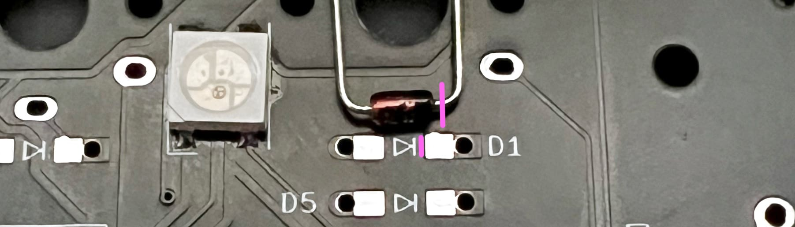
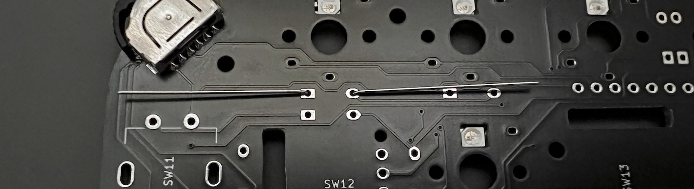
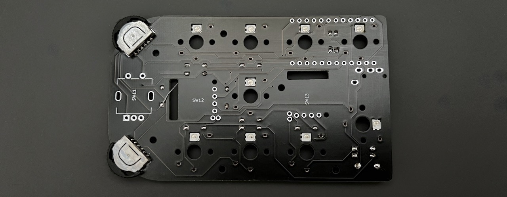
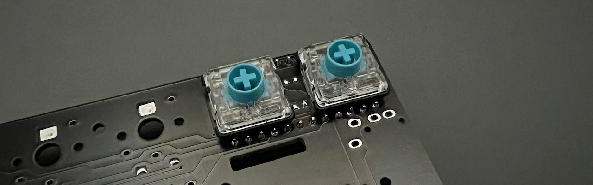
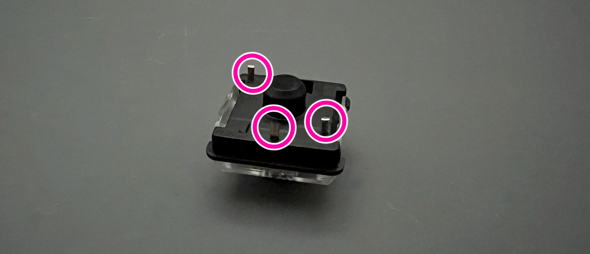
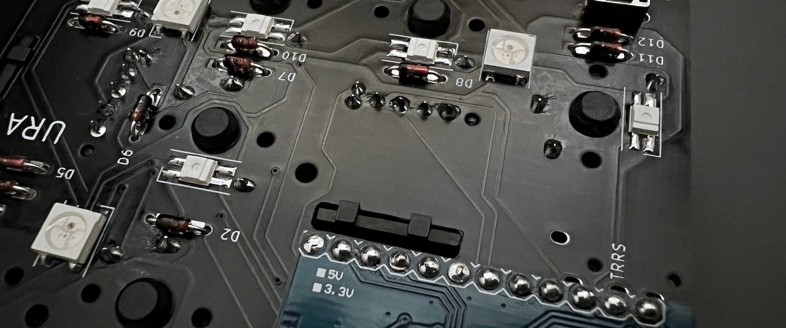
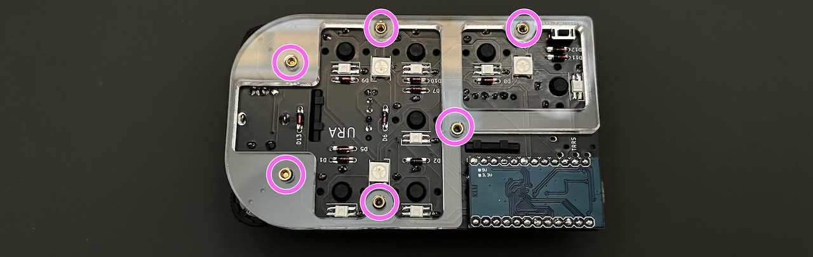
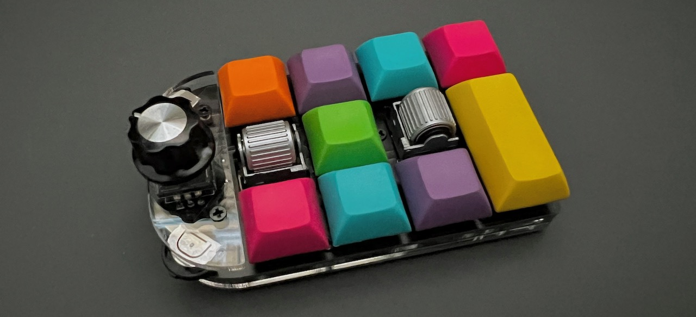

# Cannonball カーソルパッド Build Manual ([日本語](https://github.com/Taro-Hayashi/Cannonball/blob/main/README.md))
- [Contents](#Contents)
- [Soldering](#Soldering)
- [Testing](#Testing)
- [Assembling](#Assembling)
- [Customise](#Customise)

## Contents
 
||Name|Quantities| |
|-|-|-|-|
|1|Main board|1||
|2|Bottom plate|1||
|3|Middle plate #1|1||
|4|Middle plate #2|1||
|5|Cover plate|1||
|6|Short screws|4|3mm|
|7|Middle screws|2|4mm|
|8|Long screws|6|6mm|
|9|Short spacers|6|3mm|
|10|Middle spacers|2|4mm|
|11|Diodes|13|1N4148|
|12|Tactile Switches|1||
|13|Dial Rotary Encoder|1|EC11|
|14|Knob|1||
|15|Wheel Rotary Encoders|2|EVQWGD001|
|16|Rubber feet|6||
|17|Pro Micro|1||

## Additional required
|Name|Quantities||
|-|-|-|
|Switches|9|Kailh Low Profile Switches V1/V2|
|Keycaps|9|8: 1U, 1: 2U|
|USB Cable|1||

## Optional
|Name|Quantities|||
|-|-|-|-|
|SK6812MINI-E|9|[Usage](led_EN.md)||
|WS2812B|3||

## Soldering
Install the diodes from D1 to D13.  
  
Diodes have a direction.  

Bend the legs parallel to the diode to prevent interference with the key switch later.  
 

Solder and cut the legs.  
  

Solder Tactile Switches.  
 
If you want to remove the flux from the surface, now is the time.  
 

Solder Switches.  
  
The two switches here may come in contact with the Pro Micro, so cut off the legs before soldering.  
  
In the case of the choc V1 switch, one of the legs will interfere with the switch, so cut it short.  
  
  

Solder Pro Micro.  
  
  

Solder rotary encoders.  
  
   
   
  
  

## Testing
Connect one of them to the PC with a USB cable.  
Access Remap's firmware page with Chrome or Edge.  
- https://remap-keys.app/catalog/OkZxVBzfCSGxdg48cNL2/firmware

Flash the Test firmware.  
  
  

Push the tactile switch.  
 
 

Make sure all switches are responsive.  
If there are no problems, soldering is finished.  

## Assembling
Disconnect the USB cable. 

Attach the short and middle spacers to the red circle.  
   
There will be middle spacers on the side of the key switch.  
  

Fasten the middle plate #2 and the back plate with long screws.  
  
  

Attach cover plate to the front with middle screws.  
  

Attaching the knob and rubber feet.  
  
Thank you for your time.  
After installing the keycap, follow the same procedure as before to update the firmware for production.  
- https://remap-keys.app/catalog/dTmFWd6gilf5ziDWE1TR/firmware
  
  
### Firmware Code
- https://github.com/Taro-Hayashi/qmk_firmware/tree/tarohayashi/keyboards/tarohayashi/cannonball

### Plates data  
- [cannonball_plates.zip](https://github.com/Taro-Hayashi/Cannonball/releases/download/14.31/cannonball_plates.zip)  

### Misc
Used foostan's footprint.  
- https://github.com/foostan/kbd/  
- https://github.com/foostan/kbd/blob/master/LICENSE  

Used plut0nium's footprint.  
- https://github.com/plut0nium/0xLib  
- https://github.com/plut0nium/0xLib/blob/master/LICENSE.txt  

 

- Yushakobo: https://shop.yushakobo.jp/en/products/2797   
- BOOTH: https://tarohayashi.booth.pm/items/3172502
