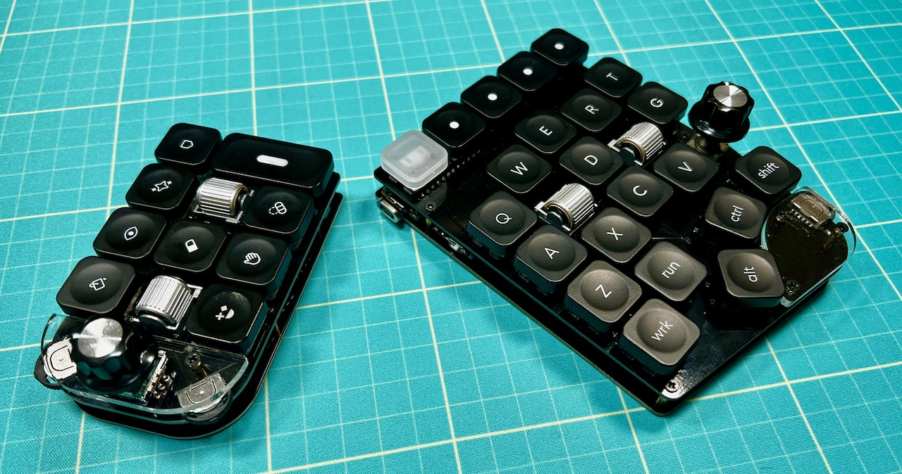
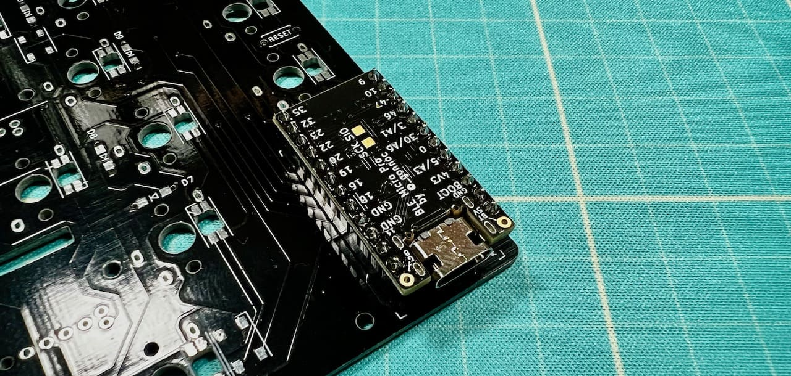
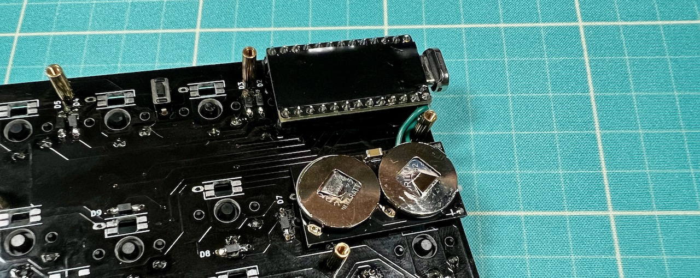
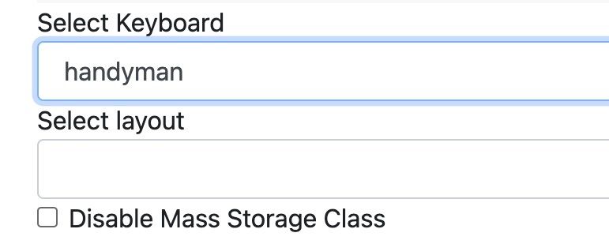
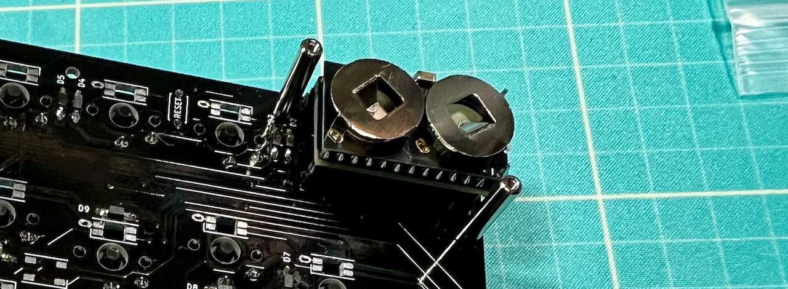
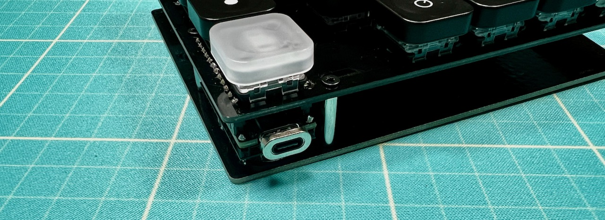

# BLE Micro Proの使用例

## 用意するもの
||
|-|
|BLE Micro Pro|
|BLE Micro Pro用電池基板|
|ピンヘッダー|
|ピンソケット|
|スペーサー（9mm) |
|リード線|
|絶縁できるテープ|
|厚めの両面テープ|
|CR1632|
|USB Type-C ケーブル|

## ご注意
- BLE Micro Pro、電池基板の使い方や組み立て方は各製品のものをご覧ください。
- 有線接続時のLEDの発光には対応していません。  

## 組み立て
メインボードとピンソケット、BLE Micro Proとピンヘッダーをはんだ付けします。
  
ピンヘッダーとピンソケットは12ピン分に切って使っています。

リード線で電池基板と接続して、両面テープ等で固定します。
  
部品同士が接触しないように適宜絶縁テープを使ってください。

付属のスペーサーの代わりに9mmスペーサーを使い、アクリルミドルプレートなしでボトムプレートをねじ止めしたら完成です。
  

## ファームウェアの書き込み
BLE Micro Pro WebConfigratorにGoogle Chromeでアクセスしてください。 
- BLE Micro Pro WebConfigrator https://sekigon-gonnoc.github.io/BLE-Micro-Pro-WebConfigurator/  

"ナビゲーション付き〜"の青いボタンをクリックしてあとは画面に従ってインストールしてください。
  
  
エンコーダーの回転が反映されない場合はENCODER.JSNをこちらに上書きしてください。
- Handyman用 https://github.com/Taro-Hayashi/Handyman/releases/download/0.18.14/ENCODER.JSN
- Cannonball用 https://github.com/Taro-Hayashi/Cannonball/releases/download/0.18.14/ENCODER.JSN

## その他
取り外し頻度が高い場合はBLE Micro Proの上に乗せるように電池基板を固定すると取り回しがよくなります。その場合は15mmスペーサーを使ってください。  
  
  
試していませんがマイコンボードに重なる2つのキースイッチを取り付けず、表面にBLE Micro Proを固定するのもいいと思います（表裏にご注意ください）。お好きなところにマイコンボードや電池基板を設置して組み立ててみてください。  
   
ブラウザの機能で戻ってください。  
