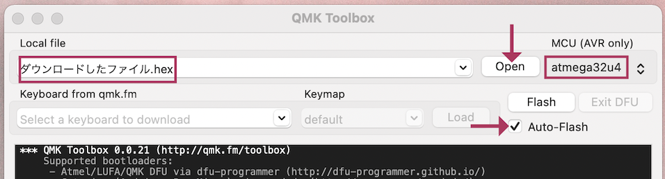
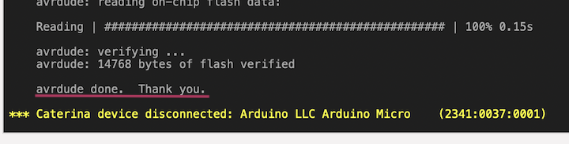
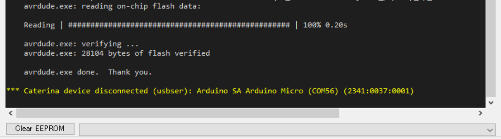

## QMK Toolboxを使ったファームウェア更新方法

QMK Toolboxのreleaseページから最新版をダウンロードしてインストールください（Betaはおすすめしません）。  
- [Releases・qmk/qmk_toolbox](https://github.com/qmk/qmk_toolbox/releases)

  
起動したらOpenを押してダウンロードしたファームウェアを指定し、キーボード裏面のリセットボタンを押します。  
   
新しく黄色の文字が出てきたらFlashを押します。  
  

Thank youの後に黄色い文字が出たら更新完了です。  
   

ブラウザの機能で戻ってください。  
