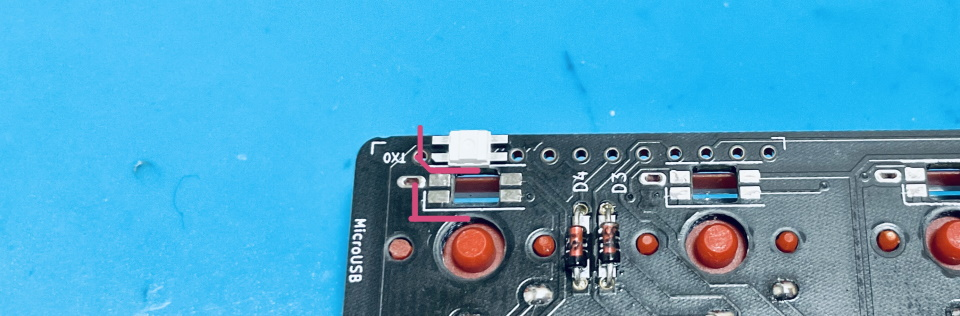
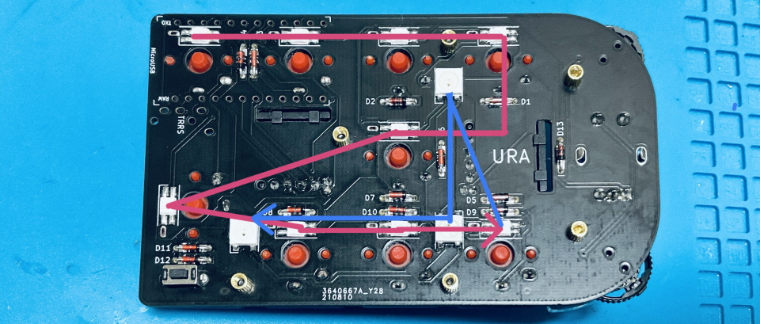
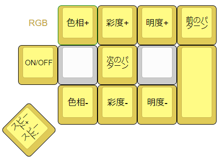

## LEDの取り付け方
LEDのはんだ付けはいつ行っても大丈夫です。  
一旦LEDなしで完成させてから後日やってもいいですし、ファームウェア書き込みの知識がある方は先にLEDだけ付けて発光のテストをすることもできます。  
失敗しても光らないだけなので気軽に挑戦してみてください。   

LEDの切り欠きとシルク印刷のコーナーを合わせてはんだ付けしましょう。  
  
  
向きがバラバラなので毎回確認してください。  
メインボードにフラックスを塗り、こて先にのせたはんだを流し込むようにするとスムーズに付けられます。
   
両側のランドにはんだを乗せやすいようにLEDは中央に置くことを意識するといいと思います。  

LEDテスト用のファームウェアです。  
- [ledtest_default.tex](https://github.com/Taro-Hayashi/Cannonball/releases/download/14.20/ledtest_default.hex)  

LEDは直列に配線されています。  
  
ひとつ発光しないLEDがある場合その先のLEDは正しくはんだ付けされていても光らなくなるので画像と見比べてどこが原因かを調べましょう。   

はんだ付けするだけでLEDが使えるようになります。  
ENTER長押しでRGB操作用のレイヤーになります。  
  
[Keyboard Layout Editor で見る](http://www.keyboard-layout-editor.com/#/gists/2fe2023fd6a9318985b9c40c264c6cef)

ブラウザの機能で戻ってください。
