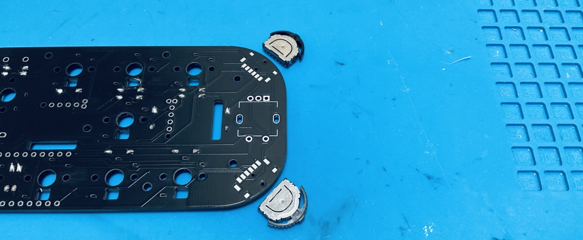
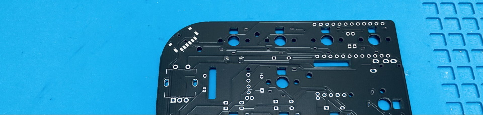

# レバースイッチのはんだ付け

ランドにフラックスを塗って位置決め用の穴に合わせて乗せます。  
  

ピンセットでレバースイッチを押さえながら、はんだごてに乗せたはんだを手前のランドにのせていきます。  
  

ちょっとプラスチックを溶かしてしまいましたがこの後ちゃんと動きました。  
  

左右はレバーを押さえながらはんだ付けします。  
  
これら4つは取り付け強度を上げるためのランドで、電気的にはどことも繋がっていません。  

  
左右にある二股に分かれている接点ははんだが乗りにくいので無理に接着しなくても大丈夫です。  
   

ブラウザの機能で戻ってください。
