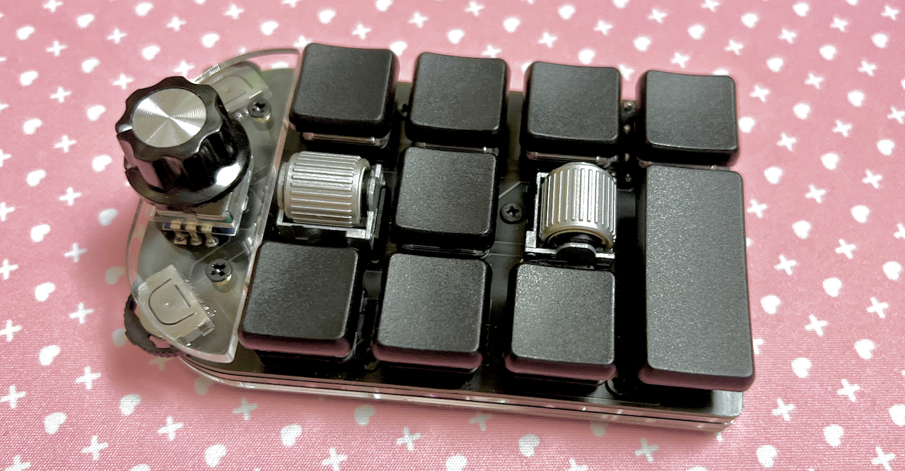
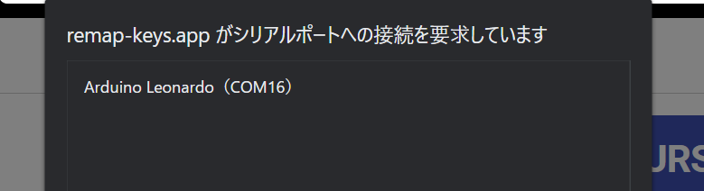
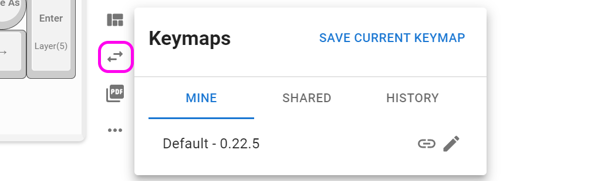
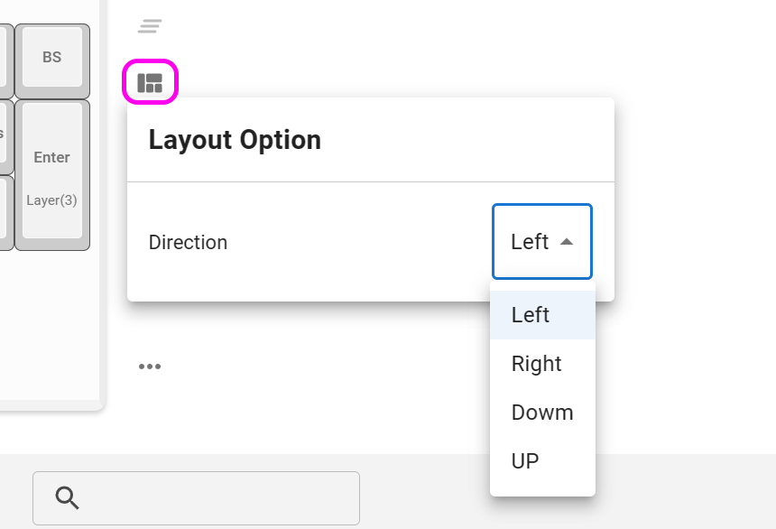
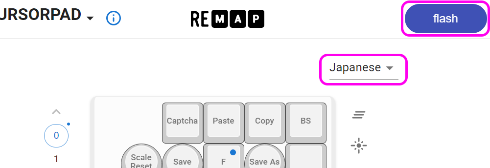
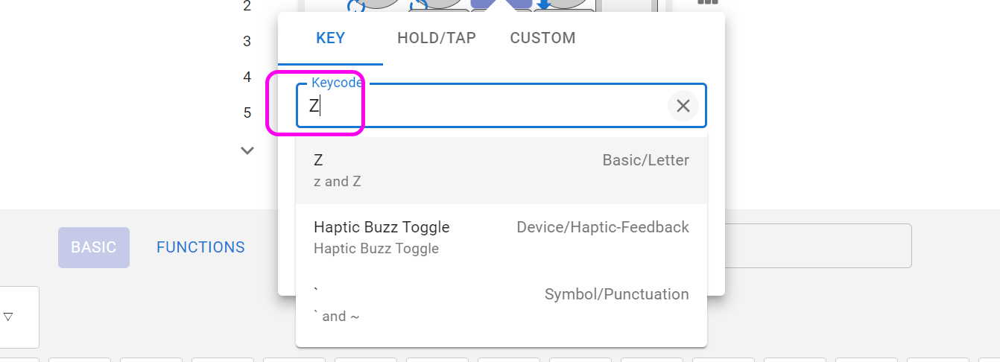
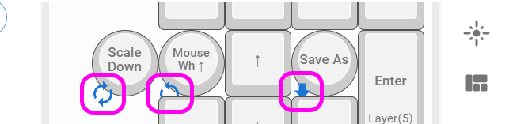

# Cannonball カーソルパッド 取り扱い説明書

 
  
## ファームウェアの書き込み
到着したらまずは最新のファームウェアを書き込みます。

- https://remap-keys.app/catalog/OkZxVBzfCSGxdg48cNL2/firmware
  
Google ChromeかMicrosoft Edgeでこちらのサイトにアクセスし、Remap用ファームウェアのFlashをクリックします。

 
 
このようなダイアログが出てくるのでキット裏面のリセットスイッチを押すと新しく項目が出てきます。
 

※通常は1回押すだけで出てきますが2回素早く押す必要があることがあります。

選択して接続を押すと書き込みが始まり、完了します。

 
CLOSEを押してキーのカスタマイズに移ります。

## キーのカスタマイズ
こちらのサイトにアクセスしてください。
- Remap https://remap-keys.app

  
左を選んで進んでいくとダイアログが出てキーボードを選択できます。  
  
選択して接続してください。
  

### キーマップの保存と復元
⇔アイコンで作ったキーマップを保存することができます。  
  
作ったキーマップを共有することもできるので是非お試しください。

### 方向を変える
レイアウトオプションで方向を変えることができます。  
  

### キーを設定する
下のキー一覧からドラッグアンドドロップし、変更が終わったら右上のflashボタンを押すと反映されます。  
  
また、USキーボードとJISキーボードはFlashの下のプルダウンから変更できます。OSの設定に合わせてください。

### 修飾キーとの組み合わせを設定する
上のキーボードのキーをクリックすると設定画面になります。
  
修飾キーと同時押ししたいキーを検索し、同時押ししたい修飾キーにチェックを入れます。
  

Hold-Tapもここから設定できます。

### ロータリーエンコーダーを設定する
丸いキーの左下をクリックすると時計回り、反時計回り、押し込みを切り替えることができるので、それぞれにキーを割り当てます。
  

### 特殊なキーを設定する
FUNCTIONSタブのVIA USER KEYにあらかじめ用意されたショートカットキーがあります。
  

