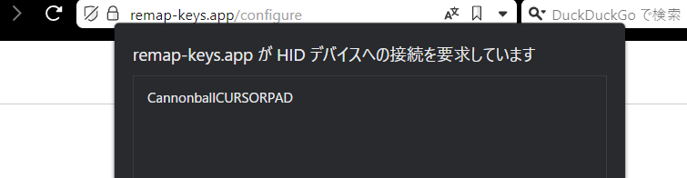
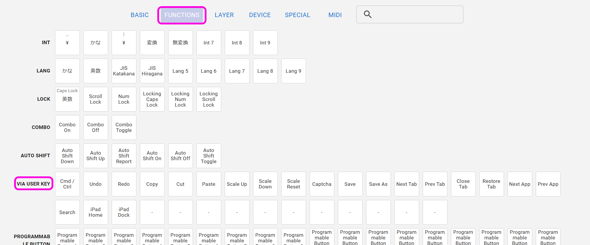

# Cannonball カーソルパッド 取り扱い説明書

## 内容品
- Cannonball カーソルパッド 1個

 
  
## ご用意いただくもの
- USBケーブル
- Windows/Mac/Linux（iPad、Androidでも使用できますが設定ができません）
  
## ファームウェアの書き込み
まず動作ソフト（ファームウェア）をCannonballに書き込みます。  
Google ChromeかMicrosoft Edgeでこちらにアクセスし、Remap用ファームウェアのFlashをクリックします。

- https://remap-keys.app/catalog/OkZxVBzfCSGxdg48cNL2/firmware
  

   
   
  
キット裏面のリセットスイッチを２回素早く押すと新しく項目が出てきます。
  
   
  

選択して接続を押すと書き込みが始まります。

 
CLOSEを押してファームウエアの書き込みは完了です。

## キーのカスタマイズ
Google ChromeかMicrosoft Edgeでこちらにアクセスしてください。
- Remap https://remap-keys.app

  
左を選んで進んでいくとダイアログが出てキーボードを選択できます。  
  
選択して接続してください。
  

### キーマップの保存と復元
⇔アイコンで作ったキーマップを保存することができます。  
  
作ったキーマップを共有することもできるので是非お試しください。

### 方向を変える
レイアウトオプションで方向を変えることができます。  
  

### キーを設定する
下のキー一覧からドラッグアンドドロップし、変更が終わったら右上のflashボタンを押すと反映されます。  
  
また、USキーボードとJISキーボードはFlashの下のプルダウンから変更できます。OSの設定に合わせてください。

### 修飾キーとの組み合わせを設定する
キーボードのキーをクリックすると設定画面になります。
  
修飾キーと同時押ししたいキーを検索し、同時押ししたい修飾キーにチェックを入れます。
  

Hold-Tapもここから設定できます。

### ロータリーエンコーダーを設定する
丸いキーの左下をクリックすると時計回り、反時計回り、押し込みを切り替えることができるので、それぞれにキーを割り当てます。
  

### 特殊なキーを設定する
FUNCTIONSタブのVIA USER KEYにあらかじめ用意されたショートカットキーがあります。
  

## その他

### キーキャップの引き抜き方
スイッチはキーキャップ側から見て下部の2点ではんだ付けされています。上部を持ち上げるように手前に引っ張ると金具が曲がり隙間が出来てしまうことがあります。
キーキャップ引き抜き用の工具を使い側面を掴み垂直に引き抜く事を意識すると抜きやすいです。
  
※2U（長いキー）はスイッチの向きが違うので縦横を変えて考えてください。

### ファームウェアのフォルダ  
https://github.com/Taro-Hayashi/qmk_firmware/tree/tarohayashi/keyboards/tarohayashi/cannonball

### 謝辞
plut0nium様のフットプリントを流用、改変して使わせていただきました。  
https://github.com/plut0nium/0xLib  
https://github.com/plut0nium/0xLib/blob/master/LICENSE.txt  

 この キット は <a rel="license" href="http://creativecommons.org/licenses/by-sa/4.0/">クリエイティブ・コモンズ 表示 - 継承 4.0 国際 ライセンス</a>の下に提供されています。

### 販売サイト
- 遊舎工房: https://shop.yushakobo.jp/collections/keyboard/products/2797   
- BOOTH: https://tarohayashi.booth.pm/items/3172502

