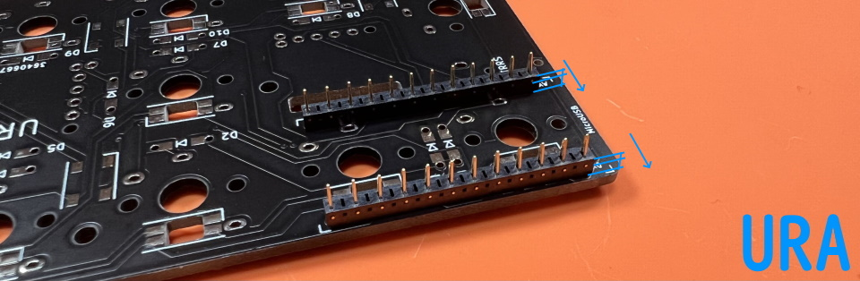
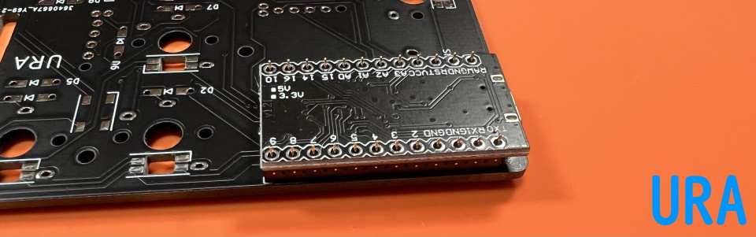
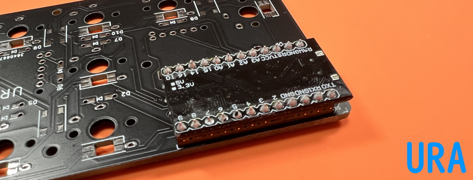
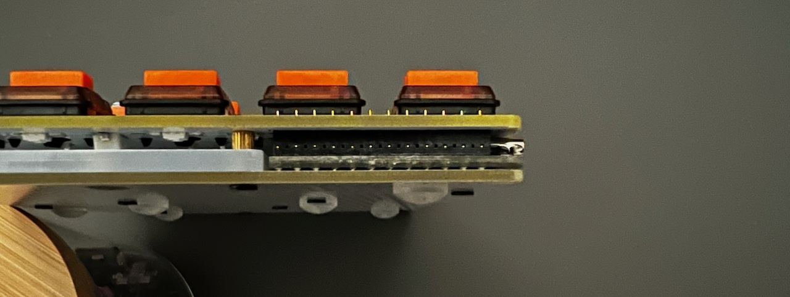

# Pro Micro互換品とコンスルーの対応表

||ピンヘッダ|2.5mmコンスルー|3.5mmコンスルー|
|-|-|-|-|
|Pro Micro|○|○|○|
|Type-C版Pro Micro|×|×|○|
|Elite-C|○|○|○|
|Elite-Pi|△|△|△|

△: おそらく使用可能、要QMKビルド環境  

## コンスルーの使い方

コンスルーを使うとPro Microを基板に抜き差しできるようになります。

基板裏面にコンスルーを立てます。  
  
コンスルーの窓が高く、向きが同じになるようにします。  
基板側にはんだ付けはしません。  
  
Pro Microを乗せます。TX0, RAW, USBの位置をシルク印刷と合わせましょう。  
  
Pro Microをはんだ付けします。 
   
コンスルーを使う場合ははんだ付け手順のPro Microのはんだ付けは飛ばして動作確認に進んでください。

3.5mmコンスルーをご利用の場合は高さ方向にシビアなためはんだを盛りすぎないように気をつけてください。
 

ブラウザの機能で戻ってください。  
